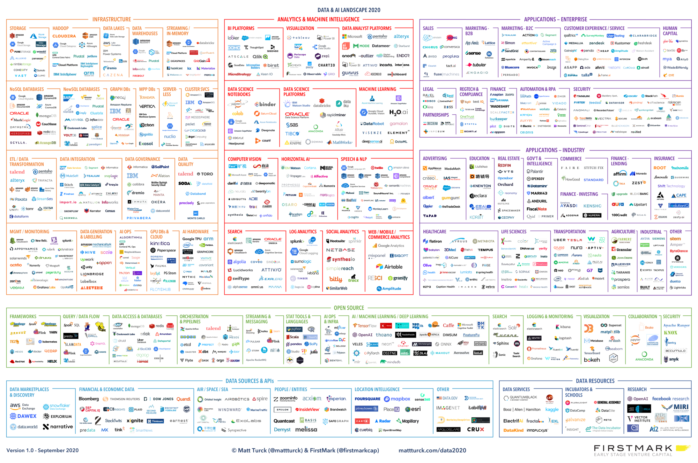

<!--
_class: lead
_paginate: false
_footer: ""
-->

# Big Data Tools:
# Holy Grail of Deveoper Productivity

Pasha Finkelshteyn, JetBrains

---

# Who am I

- ex system administrator
- ex developer
- ex team lead
- ex data egineer
- developer advocate for big data

Together >14 years in IT

---

# Who are data engineers?

Responsibilities:
- Build your DWH
- Build your DMP
- Transfer and store your data

As effective and fast as possible

---

<!-- _class: lead -->

# I know pain points of data engineering

---

<!-- _class: lead -->

# I know pain points of data engineering

And today I'll try to solve them for you

---

<!--
_color: black
_class: lead
_footer: ''
-->
# Lots of tools

---

# Lots of tools

- Nobody may know everything
- Constant context switches
- No single point of work
