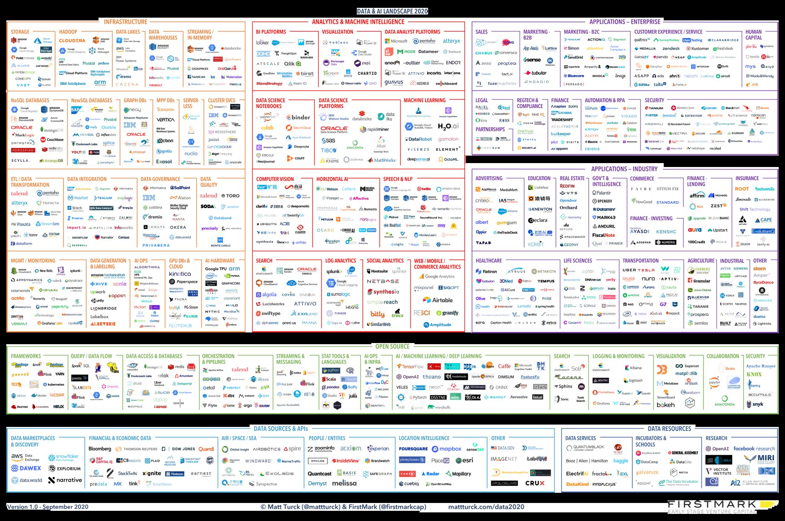
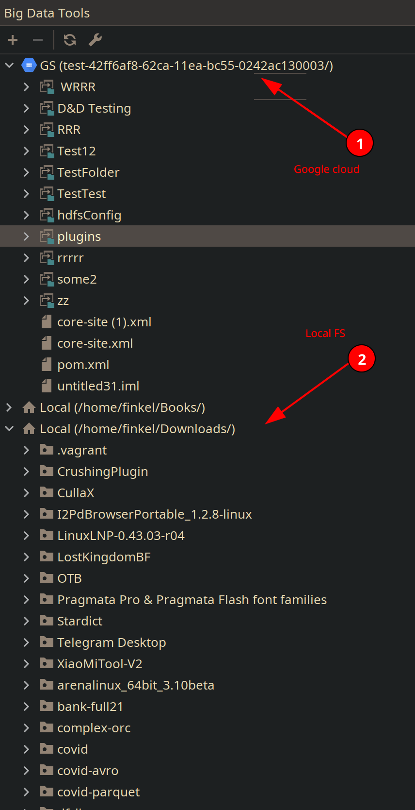
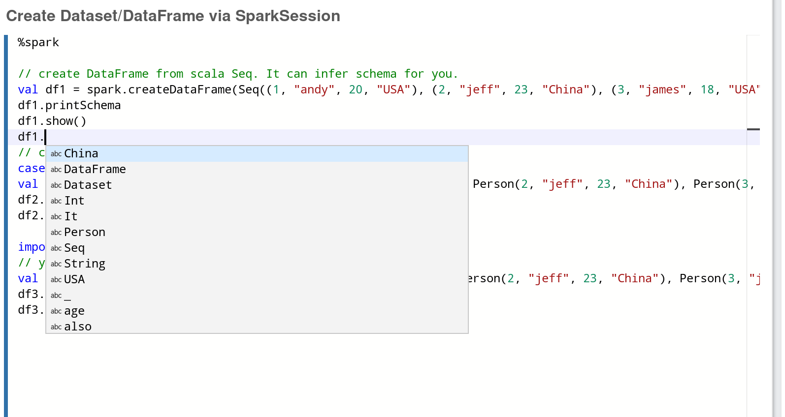
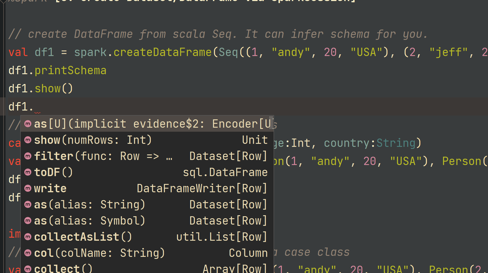
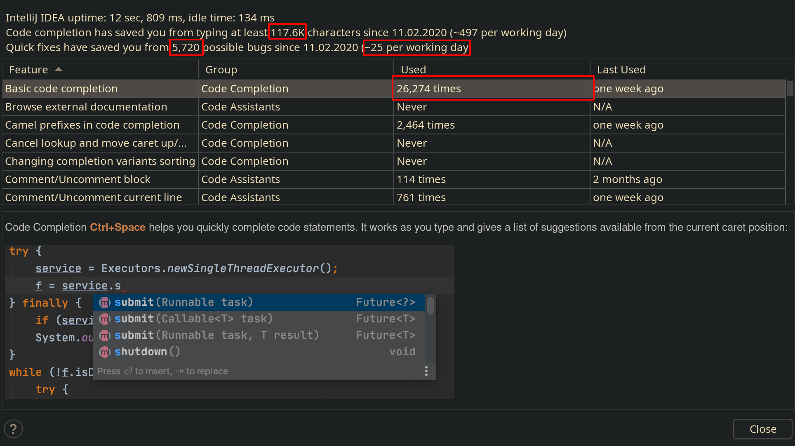
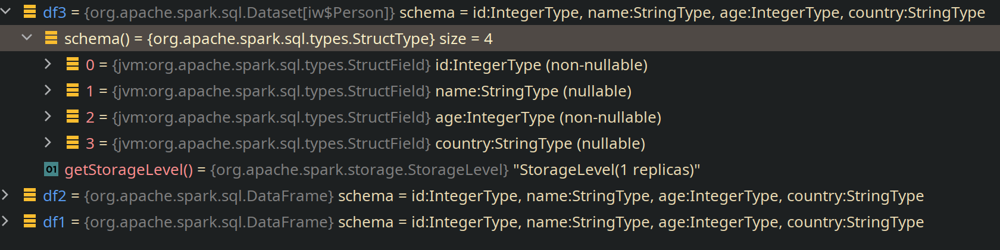

<!--
_class: lead
_paginate: false
_footer: ""
-->

# Big Data Tools:
# Holy Grail of Developer Productivity

Pasha Finkelshteyn, JetBrains

---

# Who am I

- ex system administrator
- ex developer
- ex team lead
- ex data egineer
- developer advocate for big data

Together >14 years in IT

---

# Who are data engineers?

Responsibilities:
- Build your DWH
- Build your DMP
- Transfer and store your data

As effective and fast as possible

---

<!-- _class: lead -->

# I know pain points of data engineering

---

<!-- _class: lead -->

# I know pain points of data engineering

And today I'll try to solve them for you

---

<!--
_color: black
_class: lead
_footer: ''
-->
# Lots of tools

---

# Lots of tools

- Nobody may know everything
- Constant context switches
- No single point of work

---

<!-- _class: lead -->
# Ultimate Big Data Workspace

Single IDE to work with Kafka, Spark, and storages of different types

---

# Remote FS support

- Drag'n'Drop support
- Local &harr; Remote
- Remote &harr; Remote
- Basic operations:
  - Rename
  - Move
  - Copy
  - Delete

---

# Kafka support

- Consumers (and groups)
- Topic metadata
  - Replicas
  - Partitions (and info on them)
  - Under replicated partitions

---

# Apache Zeppelin support

> Web-based notebook that enables data-driven, interactive data analytics and collaborative documents with SQL, Scala and more. 

Zeppelin is awesome environment to run ad-hoc tasks.

**But this is not the best IDE humanity developed.**

---

<!-- _color: black -->

# <!-- fit --> How autocompletion looks in web version ovf Zeppelin

---

# How Autocompletion looks in Big Data Tools

---

<!-- _class: lead -->

# Autocompletion

Autocompletion is one of the key factors of developer productivity today.

---

---

<!-- _class: lead -->

# IDE features help!

We're saving insane amount of time: preventing bugs, saving from typing, adding imports automatically…

---

<!-- _class: lead -->

# Features specific for Data Engineers

---

# Structure of dataframe

This information is not available in any environment but Big Data Tools

The same applies to Python

---

# Hadoop Monitoring

---

# Spark Monitoring

---
<!-- _class: lead -->
# <!-- fit --> Conclusion

---

# Conclusion

* Smart features
  - Autocompletion
  - Data introspection
* Monitoring
  - Hadoop
  - Spark
* Work with popular Object Storages
* Single point of integration

---

<!--
_footer: ''
_class: lead
-->

# <!-- fit --> [Big Data Tools plugin](https://plugins.jetbrains.com/plugin/12494-big-data-tools)

## Thank you!

Pasha Finkelshteyn, JetBrains

[asm0di0](https://twitter.com/asm0di0)&nbsp;&nbsp;&nbsp;&nbsp;&nbsp;[BigDataToolsJB](https://twitter.com/BigDataToolsJB)

Welcome to Q&A
